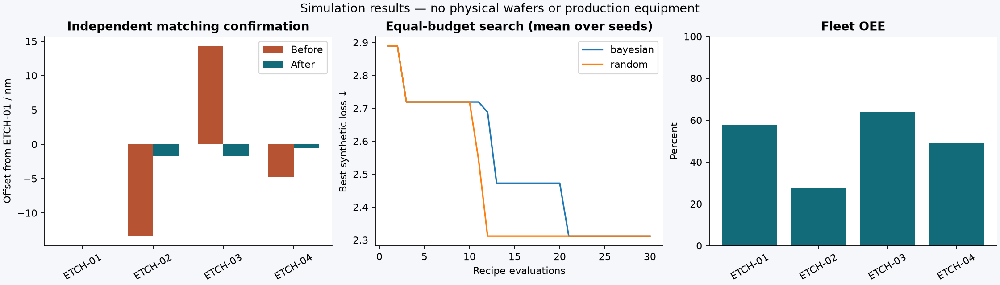
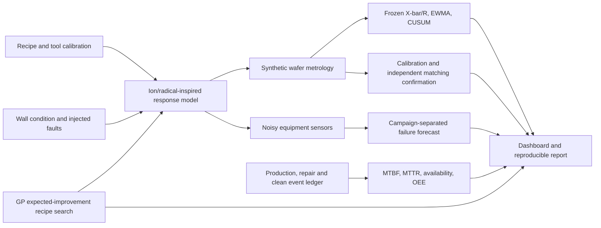
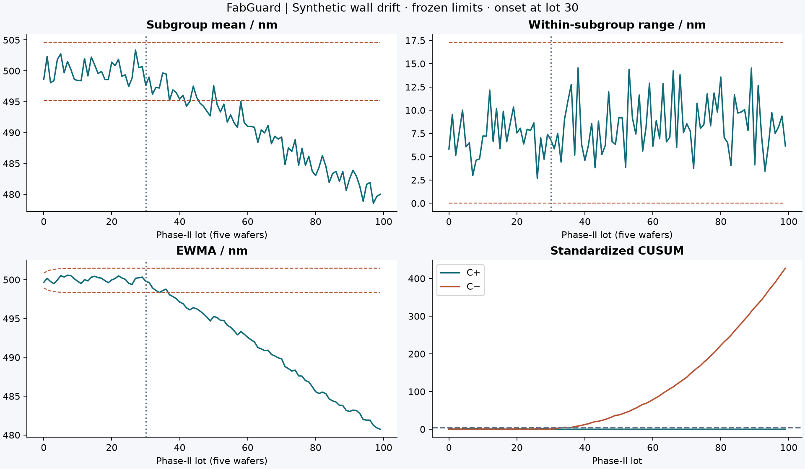

# FabGuard

**A four-chamber plasma-etch simulation lab for equipment stability, matching and maintenance analytics.**

Python · NumPy/SciPy · scikit-learn · SPC · Streamlit/Plotly

FabGuard asks a practical equipment-engineering question: **when chamber behavior changes, can the data tell us what to investigate and whether a proposed correction actually helps?** It models wafer outcomes and sensor signals, freezes statistical baselines, estimates tool offsets, accounts for downtime, forecasts failures and compares recipe-search strategies.

**All data and results are simulated.** This is an educational, physics-informed surrogate with chosen coefficients, not a calibrated digital twin or a recipe for operating an etcher. No physical experiments, real fab data, semiconductor hardware access or production improvements are claimed.



Start with the [generated experiment report](reports/reference/REPORT.md). It includes results from repeated trials, unfavorable comparisons, raw CSVs and a source/dependency manifest. The [methodology](docs/METHODOLOGY.md) explains every major assumption; the [data dictionary](docs/DATA.md) connects outputs to their meaning.

## Run it

Python 3.12 is the reference environment; Python 3.11+ is supported. From this repository:

```bash
python -m venv .venv
# Windows PowerShell: .venv\Scripts\Activate.ps1
# macOS/Linux: source .venv/bin/activate
python -m pip install -e ".[dev]"
python -m pytest -q
python -m streamlit run dashboard.py
```

The dashboard opens the included reference experiment without waiting for model training. Its six views cover SPC, tool matching, reliability, maintenance forecasts, optimization and an interactive recipe sandbox.

Reproduce all experiments and audit their evidence:

```bash
python -m fabguard.experiments --seed 7 --out runs/latest
python scripts/verify_report.py runs/latest
```

Select `runs/latest` in the dashboard to inspect the new results. `--quick` reduces repeated SPC trials and search budgets for CI; quick results should not replace the reference-run claims. `requirements-reference.txt` pins the tested Python environment; install it and then `python -m pip install --no-deps -e .` for closer numerical reproduction. Library/platform differences can still affect fits and floating-point output.

## Architecture



The simulation and analytics are separate modules. Hidden `truth_*` fields exist only for auditing. The maintenance model uses an explicit allowlist of six measured/observable features; the label generator removes current failures, future windows crossing a service and incomplete negative windows. Independent campaigns form the training, validation and test sets.

## Experiments

| Study | Question | Design / evidence |
|---|---|---|
| Fleet | What are the equipment and quality losses? | Four tools × 240 lots × five wafers; timestamped production, repair and cleaning events |
| SPC | Which charts detect wall drift, and what do they miss? | 40 baseline subgroups; 100 monitored lots; six scenarios; 30 independent seeds each; retained false alarms and missed detections |
| Matching | Does time compensation transfer to new wafers? | 60 calibration wafers/tool; separate 60-wafer groups before and after; Welch intervals and ±3 nm equivalence checks |
| Maintenance | Do sensors beat age since cleaning? | Eight training, two validation, four test campaigns; forest, age-only logistic and prevalence baselines; PR-AUC, Brier, precision/recall |
| Optimization | Can a small recipe budget improve a defined tradeoff? | GP expected improvement versus random search, 30 evaluations each, three seeds, shared initial design; 300 new confirmation wafers/recommendation |



The SPC experiment isolates faults on one nominal tool without maintenance resets. The fleet experiment adds degradation, failures, resets and calibration differences. Pooling those fleet observations into one capability number would confound different processes, so capability is reported only for the separate nominal baseline.

## What makes this engineering work

- Units and model bounds are explicit. Sensor offset is distinct from a physical pressure disturbance.
- Specification limits are separate from statistical control limits. A detected change calls for investigation, not automatic recipe adjustment.
- Matching recommendations use calibration measurements, then face independent confirmation; statistical non-significance is not labeled equivalence.
- Cleaning downtime is counted. MTBF and MTTR have named denominators; zero failures does not produce a made-up infinite reliability estimate.
- The predictive model is evaluated against simple baselines. Forecast skill is not converted into invented maintenance savings.
- Bayesian search must compete against an equal-budget baseline. Its weighted objective and soft constraint penalties are open to inspection; best observed loss is not a global optimum.

## Complement to FabTwin

[FabTwin](https://github.com/mojaffri/FabTwin) follows a **deposition process** through dynamic thermal/vacuum behavior, compiled C++ control, DOE/ANOVA and virtual metrology. FabGuard studies **etch equipment across a fleet**: stability, drift, matching, service events, reliability and maintenance forecasts. FabGuard deliberately has no duplicate embedded controller or deposition virtual-metrology model.

## Repository map

```text
src/fabguard/model.py         Recipe bounds, tool variation, wafer response and sensors
src/fabguard/fleet.py         Equipment campaigns and event accounting
src/fabguard/spc.py           Five-wafer subgroup charts and capability
src/fabguard/maintenance.py   Censored horizon labels and honest held-out evaluation
src/fabguard/matching.py      Calibration offsets and confirmation intervals
src/fabguard/optimize.py      GP/EI search, random baseline and confirmations
src/fabguard/experiments.py   Reproduction entry point, CSVs, figures, report and hashes
dashboard.py                 Local evidence browser and recipe sandbox
tests/                       Arithmetic, boundaries, accounting, leakage and dashboard checks
scripts/verify_report.py      Independent checks against saved evidence
reports/reference/           Generated reference results; no hand-entered metrics
docs/                        Methods, data dictionary and interpretation
.github/workflows/ci.yml      Linux/Windows test and quick-experiment workflow
```

## Limitations and next engineering steps

The etch response has no plasma transport, spatial mesh, actual gas/material chemistry, mask selectivity, wafer loading, chamber pumping dynamics or controller feedback. Nonuniformity is a scalar empirical surrogate, not a calculated radial profile. Defect and wear coefficients are assumptions. Failure hazards are deliberately related to wall condition, making simulated maintenance prediction easier than unknown field failure mechanisms. Throughput includes a fixed handling overhead but omits dispatch, queues and fab rework.

Forecast horizons count lots rather than elapsed time. Baseline capability assumes approximately independent, normal wafer variation. Alarm rates are evaluated for this model, not certified to a target in-control average run length. Optimization uses weighted loss and soft penalties; it cannot certify safe or feasible recipes. Only three optimizer seeds and four maintenance test campaigns limit the precision of comparisons.

The next useful contributions are sensor-bias consistency diagnostics, robustness tests under changed degradation laws, a prospective maintenance-policy comparison including false-alarm downtime, and real measurement-system qualification if an appropriate public or laboratory dataset becomes available. These are future work, not implemented claims.

## References

1. NIST/SEMATECH: [X-bar/R charts](https://www.itl.nist.gov/div898/handbook/pmc/section3/pmc321.htm), [CUSUM](https://www.itl.nist.gov/div898/handbook/pmc/section3/pmc323.htm), [EWMA](https://www.itl.nist.gov/div898/handbook/pmc/section3/pmc324.htm), [capability](https://www.itl.nist.gov/div898/handbook/pmc/section1/pmc16.htm). Sources for statistical definitions, not simulation coefficients.
2. Lam Research: [Etch essentials](https://newsroom.lamresearch.com/etch-essentials-semiconductor-manufacturing). Context for ion-assisted chemical removal; no proprietary tool reproduction is attempted.
3. scikit-learn: [Gaussian processes](https://scikit-learn.org/stable/modules/gaussian_process.html). Regression implementation; expected-improvement acquisition is implemented in this repository.

Independent portfolio project. No affiliation with NXP or equipment vendors. Created with AI assistance; contributors should describe their own work accurately and be able to explain the methods and limitations.
